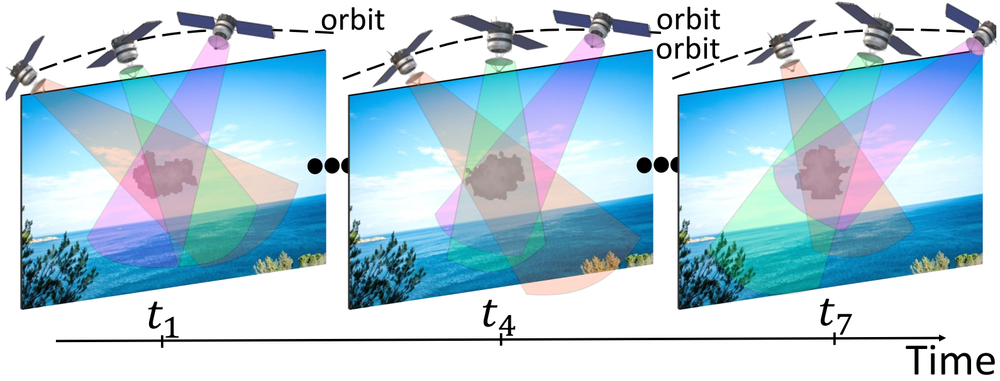

# 4D Cloud Scattering Tomography
[](https://openaccess.thecvf.com/content/ICCV2021/papers/Ronen_4D_Cloud_Scattering_Tomography_ICCV_2021_paper.pdf)

## Abstract
We derive computed tomography (CT) of a time-varying volumetric scattering object, using a small number of moving cameras. We focus on passive tomography of dynamic clouds, as clouds have a major effect on the Earth's climate. State of the art scattering CT assumes a static object. Existing 4D CT methods rely on a linear image formation model and often on significant priors. In this paper, the angular and temporal sampling rates needed for a proper recovery are discussed. Spatiotemporal CT is achieved using gradient-based optimization, which accounts for the correlation time of the dynamic object content. We demonstrate this in physics-based simulations and on experimental real-world data.


## Description
This repository contains the official implementation of 4D Cloud Scattering Tomography, which is implemented ontop of Pyshdom3.0 package [[1]].
Our framework recovers 4D cloud microphysics fields, using a small number of moving cameras. We exploits the natural temporal evolution of clouds for weighing the gradients of the different time steps for the recovery process.


[1]: https://github.com/aviadlevis/pyshdom


&nbsp;


## Installation 
Installation using using anaconda package management

Start a clean virtual environment
```
conda create -n pyshdom python=3
source activate pyshdom
```

Install required packages
```
conda install anaconda dill tensorflow tensorboard pillow joblib
```

Install pyshdom distribution with (either install or develop flag)
```
python setup.py develop
```

&nbsp;

### Data
We used cloud field data that were generated by Eshkol Eytan. Download [here](https://technionmail-my.sharepoint.com/:f:/g/personal/roironen_campus_technion_ac_il/EkwMkT74AdBMmFlD-blUIBsBPx79O3glbbVLo9CfRSYeSg?e=bjcPhv) the data and place it in 4D-Cloud-Scattering-Tomography/synthetic_cloud_fields/WIZ_Clouds/BOMEX2.
&nbsp;
For AirMSPI raw data please download the files from [here](https://technionmail-my.sharepoint.com/:f:/g/personal/roironen_campus_technion_ac_il/EpqZczvgj05NpC2JGPO8kjwBrI77-v5JKC9Cw7gJFkiPFA?e=YUPwwt) and place in 4D-Cloud-Scattering-Tomography/AirMSPI/21views.

## Main scripts
Scripts are devided into three categories: generate, render and optimize. For more information please read [here](https://github.com/ronenroi/4D-Cloud-Scattering-Tomography/blob/master/scripts/README.md).

To generate Mie scattering tables for cloud simulation and AirMSPI wavelengths
```sh
python scripts/generate_mie_tables.py  \
    --start_reff 1.0 --end_reff 25.0 --num_reff 50 --start_veff 0.01 --end_veff 0.2 --num veff 50 \
    --radius_cutoff 65.0 --wavelength 0.66 0.865
```
### Simulations
Prapare the data of Cloud1 simulations by running the following notebooks (set n_satellite 2 or 3)
```
4D_cloud_scattering_tomography/CVPR/Cloud_1_Rendering_Dynamic_Scene.ipynb
4D_cloud_scattering_tomography/CVPR/Cloud_1_Rendering_Dynamic_Scene_Multispectral.ipynb
4D_cloud_scattering_tomography/CVPR/Cloud_1_Rendering_Dynamic_Scene_Single_Platform.ipynb
```

and for Cloud2 
```
4D_cloud_scattering_tomography/CVPR/Cloud_2_Rendering_Dynamic_Scene.ipynb
4D_cloud_scattering_tomography/CVPR/Cloud_2_Rendering_Dynamic_Scene_Single_Platform.ipynb
```

Results reproducing


```
python 4D_cloud_scattering_tomography/scripts/optimize_dynamic_extinction_lbfgs.py --input_dir PATH_TO_DATA --add_rayleigh --use_forward_cloud_velocity --use_forward_grid --init Homogeneous --extinction 1 --space_carve_agreement 0.5 --log LOG_DIR  --radiance_threshold 0.03 --n_jobs 72 --maxiter 100 --reg_const 1 --use_cross_validation -1 --num_mediums -1 --sigma 20
```

For microphysics estimation (LWC and Reff) use
```
python 4D_cloud_scattering_tomography/scripts/optimize_dynamic_microphysics_lbfgs.py --input_dir PATH_TO_DATA --add_rayleigh --use_forward_cloud_velocity --use_forward_grid --const_veff --const_reff --one_dim_reff --init Homogeneous --n_jobs 72 --log LOG_DIR --maxiter 100 --use_cross_validation -1 --num_mediums -1 --reg_const 1 --sigma 20 --lwc 0.06 --reff 6

Set different values of sigma for 4D recovery. Manually choose space_carve_agreement and radiance_threshold values according to the generated data (single platform or 2 or 3 satellites). Static recovery can be obtained by setting sigma=0, num_mediums=1 and reg_const=0.

&nbsp;

### AirMSPI
Data preparation and preprocessing

screen python Develop_Dynamic_cloud/scripts/optimize_dynamic_extinction_AirMSPI_lbfgs.py --input_dir Develop_Dynamic_cloud/experiments/AirMSPI/dynamic_medium/monochromatic --add_rayleigh --use_forward_cloud_velocity --use_forward_grid --init Homogeneous --extinction 1 --space_carve_agreement 0.9 --log log_num_mediums_1  --radiance_threshold -0.03 --n_jobs 72 --maxiter 100 --reg_const 0 --use_cross_validation -1 --num_mediums 1 --sigma 0 --nx 50 --ny 50 --nz 50

 screen python Develop_Dynamic_cloud/scripts/optimize_dynamic_extinction_AirMSPI_lbfgs.py --input_dir Develop_Dynamic_cloud/experiments/AirMSPI/dynamic_medium/monochromatic --add_rayleigh --init Homogeneous --space_carve_agreement 0.9 --radiance_threshold -0.03 --ext 1 --nx 80 --ny 80 --nz 80 --log cvpr_num_mediums_21_sigma_60 --n_jobs 72 --maxiter 200 --reg_const 1 --use_cross_validation -1 --num_mediums -1 --sigma 60


&nbsp;


## Usage and Contact
If you find this package useful please let me know at aviad.levis@gmail.com, I am interested.
If you use this package in an academic publication please acknowledge the appropriate publications (see LICENSE file). 

